# Precision-Trainer
A video game I made in Unity that has a goal of helping you practice your aiming precision in 3D space.

Originally built as a Windows application but I have also created a Web build you can play right now, fully inside your browser online for free:
**https://predatoriwd.github.io/Precision-Trainer/**

I have also submitted and presented this as my main project in my [Computer Games Design](https://www.viser.edu.rs/predmet/114/2325?userLanguage=eng) college class that I have finished at [The School of Electrical and Computer Engineering of Applied Studies](https://www.viser.edu.rs/) in Belgrade, Serbia.

Below is my paper on the project in Serbian which you can also get in the .docx format from the root directory of this repository.

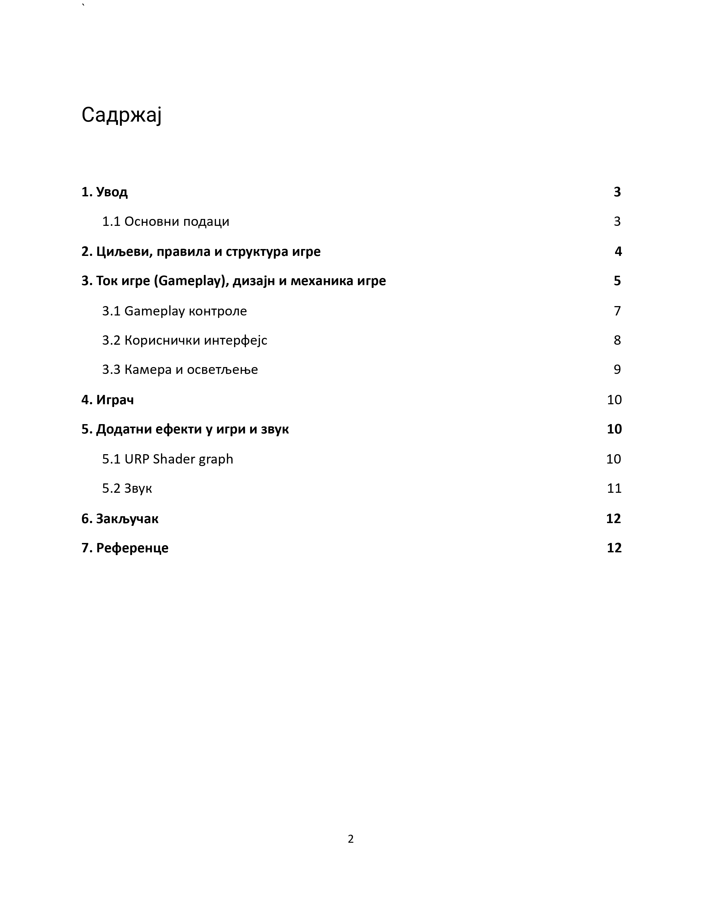
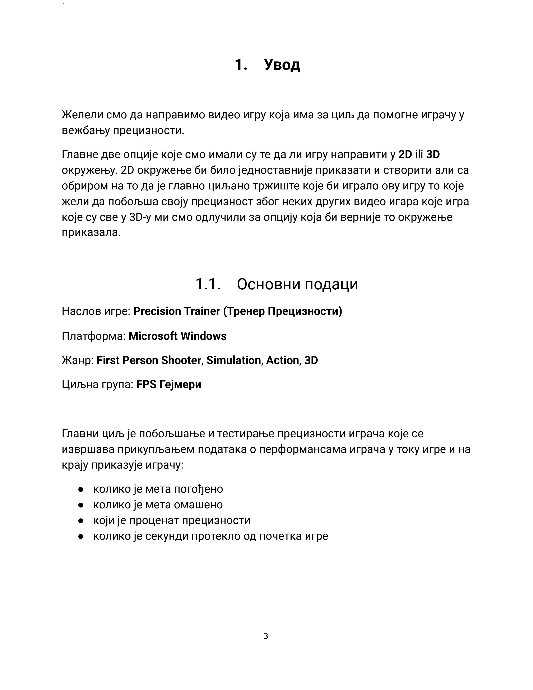
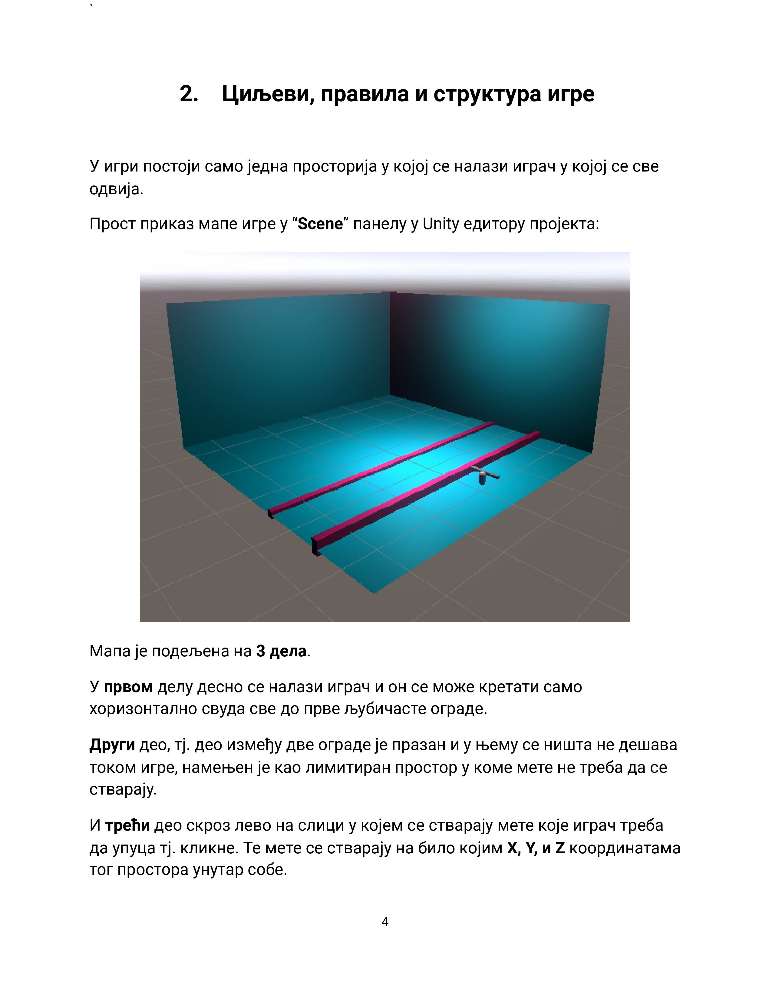
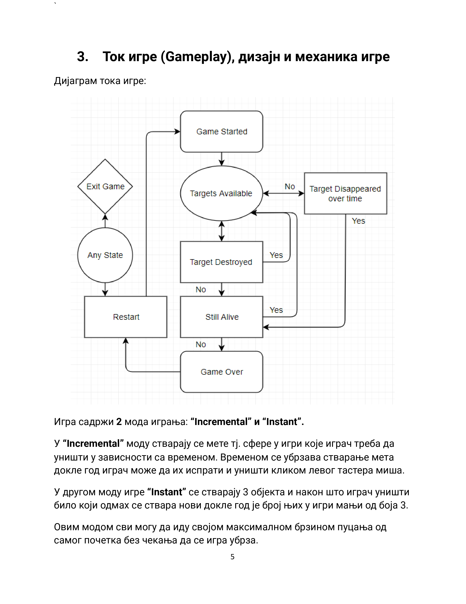
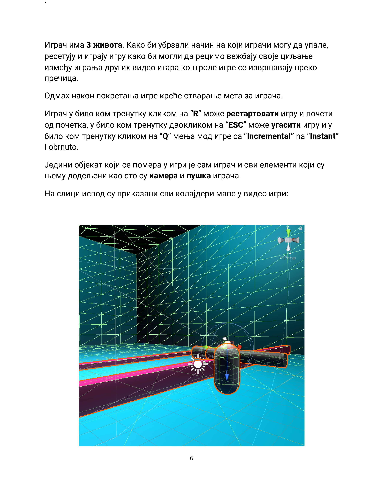
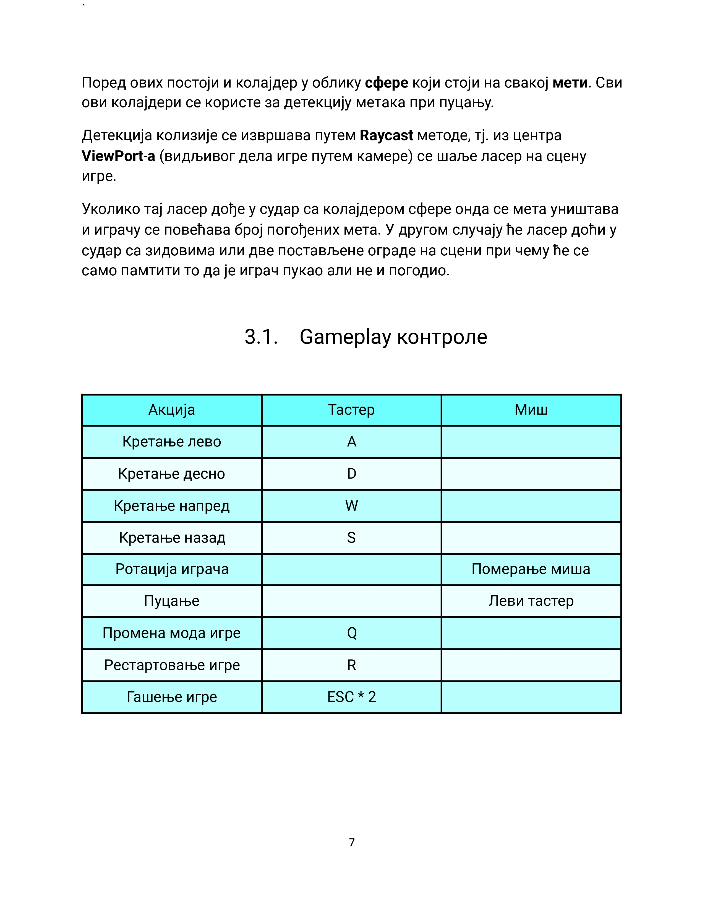
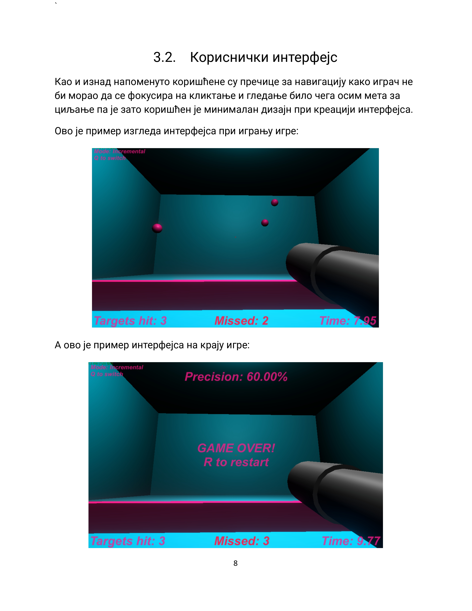
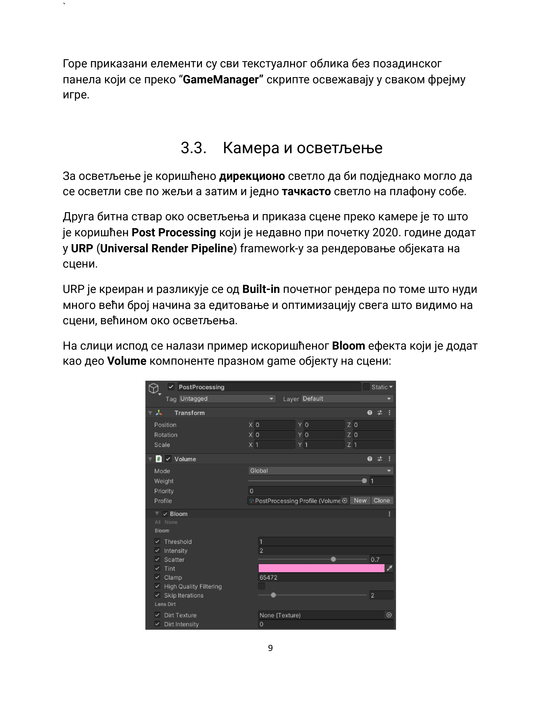
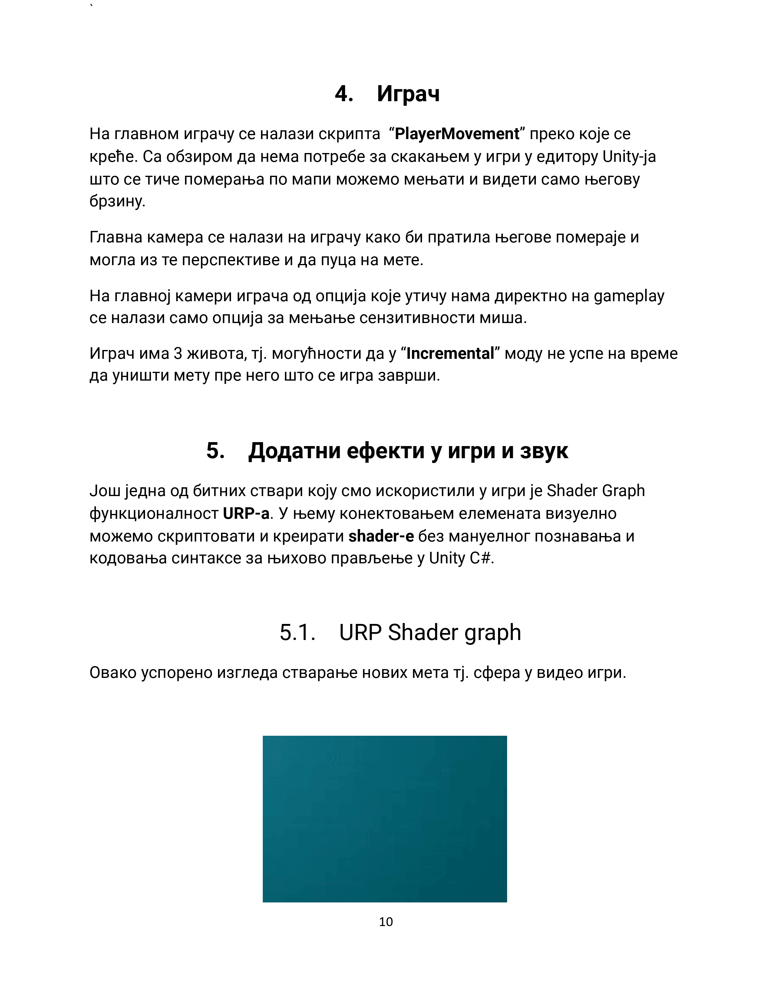
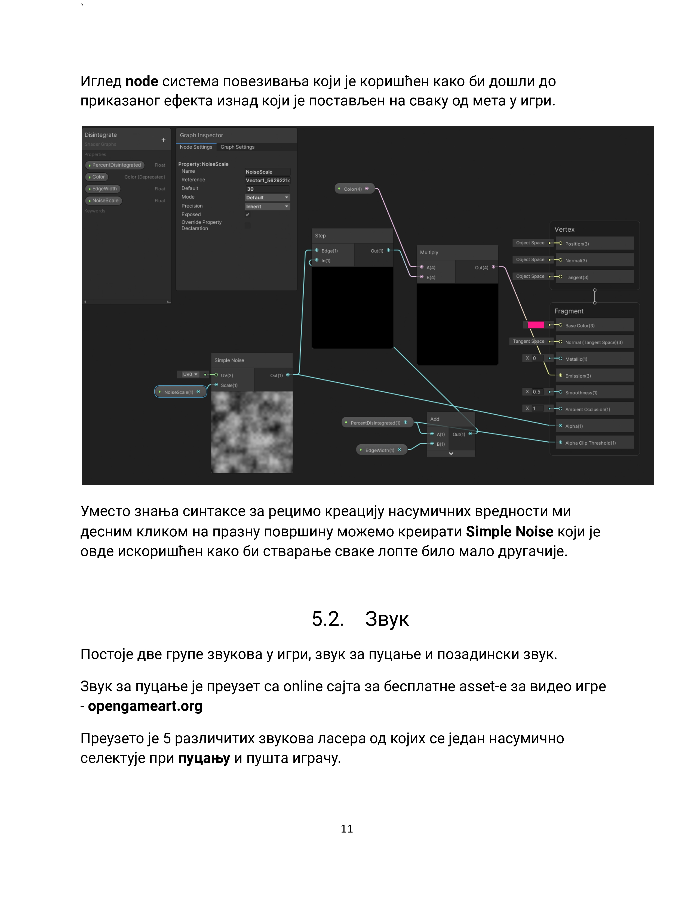
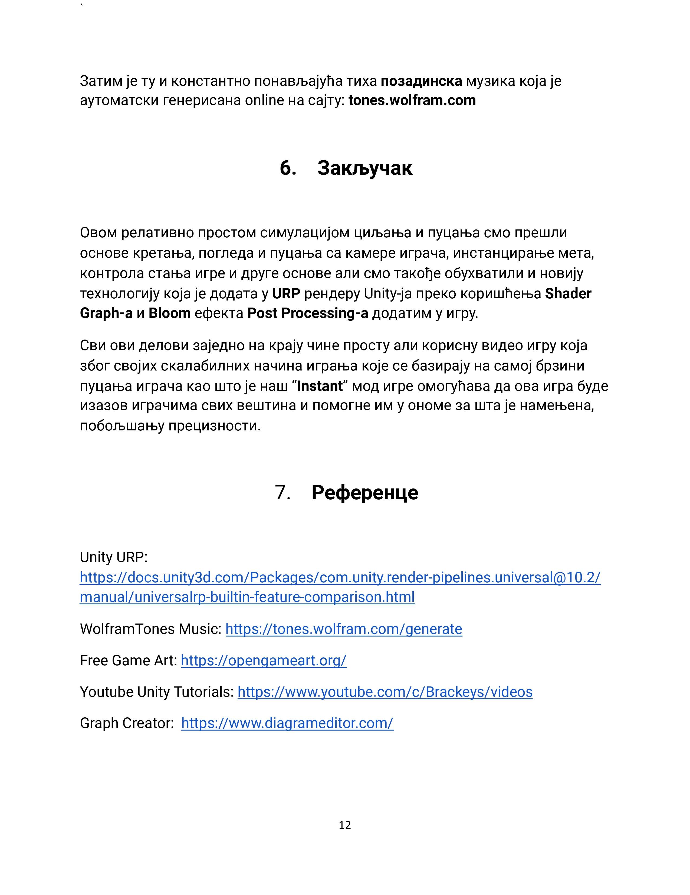